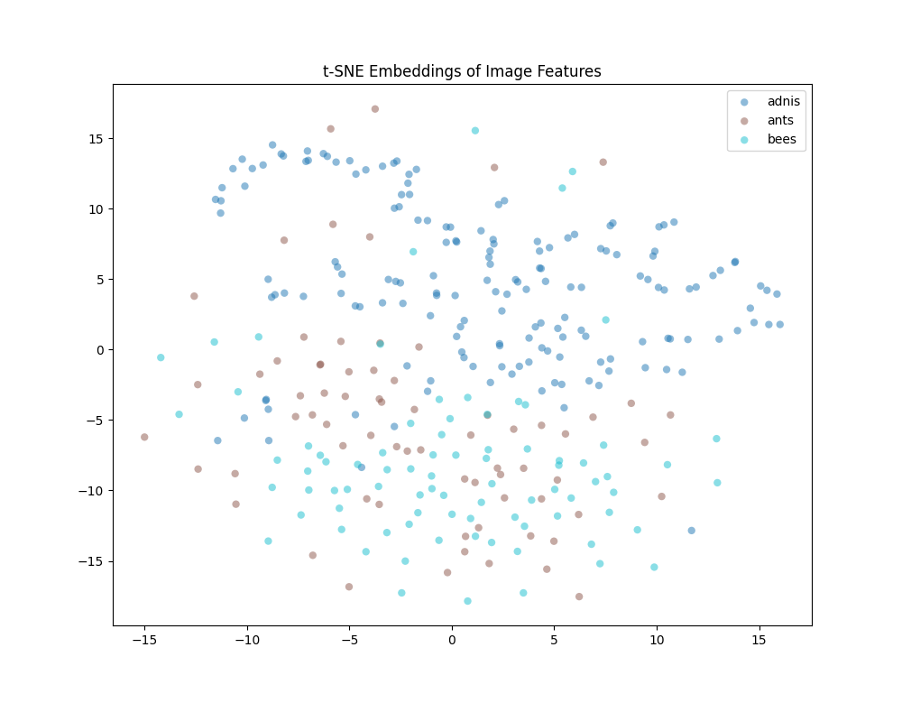

## Visualize your extracted features with t-SNE
This repository contains an implementation of a visualization technique called t-SNE (t-Distributed Stochastic Neighbor Embedding) for visualizing high-dimensional features of a group of classes. The code is written in Python and makes use of the scikit-learn library for machine learning.

### Getting Started
To get started with this project, you will need to have Python 3 and the scikit-learn library installed on your machine. You can install scikit-learn using pip:
```
pip install scikit-learn
```
Once you have scikit-learn installed, you can clone this repository to your local machine:
```
git clone https://github.com/ifarady/initial-feature-embedding.git
```
Run:
```
python initial-feature.py
```
### Usage
This repository provides a tool for visualizing the distribution of high-dimensional features in your dataset using t-SNE. By visualizing the features of your training data, you can gain insights into its structure and identify any potential challenges that may arise during classification or other deep learning tasks. It's important to note that t-SNE visualization does not guarantee successful classification, as the separation of high-dimensional feature space may not reflect the structure of your testing data. Therefore, it is important to carefully analyze the properties and conditions of your data in conjunction with the t-SNE visualization.

Here are the steps to use this tool:

1.  **Collect and organize the image data:** Collect all the images you want to use for your project and organize them into separate folders based on their corresponding class labels. Store your dataset in the `/dataset/` directory.
    
2.  **Load the pre-trained CNN:** You can either manually download a pre-trained CNN model such as VGG16 or ResNet50, or use the code provided in this repository to download and use the default pre-trained ResNet18 model. The pre-trained CNN model is used to extract high-dimensional features from your image data.
    
3.  **Extract features from the images:** Pass each image through the pre-trained CNN and extract the features from one or more of its hidden layers. The output of the hidden layers will be a set of high-dimensional features that describe the contents of the image.
    
4.  **Collect the features for each class:** Collect the features for each image in a given class and concatenate them into a single feature matrix for that class. Repeat this process for each class to obtain a set of feature matrices.
    
5.  **Reduce the dimensionality:** Use PCA to reduce the dimensionality of the feature matrices while retaining the most important information. This will make it easier to visualize the features in a lower-dimensional space.
    
6.  **Plot the features using t-SNE:** Apply t-SNE to the reduced feature matrices to visualize the high-dimensional features in a 2D or 3D space. This will help you identify clusters of similar features and gain insights into the relationships between different classes.
    
7.  **Visualize the t-SNE plot:** Create a visualization tool that allows you to interact with the t-SNE plot and explore the features in more detail. This tool can be used to select specific classes and explore their corresponding feature distribution in the t-SNE plot.

### Disclaimer
Some parts of this code are adapted from publicly available code repositories, as specified in the comments within the code. We have made modifications to the code to fit our specific use case. All credit for the original code goes to the respective authors. We do not claim ownership of any of the code we have adapted. Use this code at your own risk.
